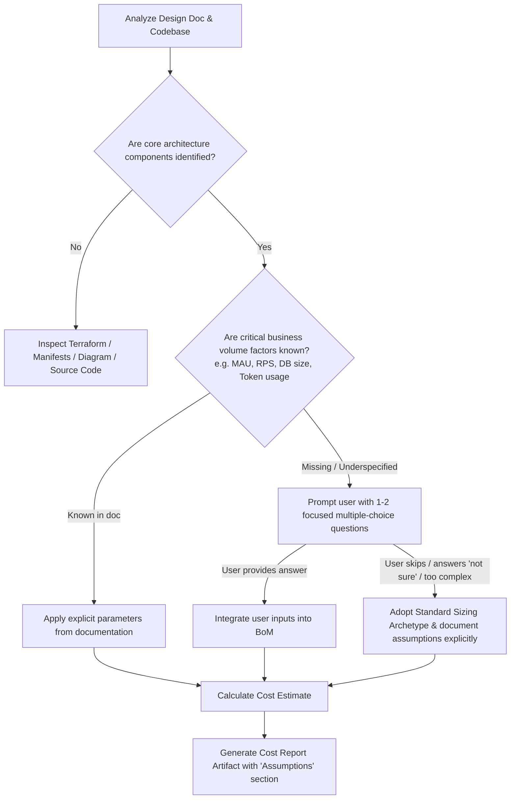

# Standard Baseline Assumptions & Workload Sizing Profiles

When estimating GCP cloud infrastructure costs, certain workload metrics (e.g. exact QPS, active user counts, query data scanned, token lengths) may be unspecified in design documents or code, or the user may not possess exact telemetry yet.

This document establishes the official default heuristics, fallback profiles, and assumption rules.

---

## 1. Workload Sizing Profiles (Archetypes)

If the user does not specify traffic or scale, the agent should categorize the application into one of the four baseline archetypes:

### Archetype A: Dev / Sandbox / Internal Demo
- **Target Scale**: 10–100 active users, developer testing, zero SLA.
- **Compute**: Cloud Run scale-to-zero (0 min instances, max 2) OR 1× `e2-medium` (8h/day or 730h/month).
- **Database**: Cloud SQL `db-custom-1-3840` (Single-zone) or Firebase/Firestore Spark/Blaze Tier, 10 GB SSD.
- **Traffic**: ~1,000 requests/day (~30,000 reqs/month).
- **Storage**: 10 GB GCS Standard.
- **AI/LLM**: ~500 prompts/month (Gemini 3.7 Flash).
- **Networking**: <10 GB egress/month.

### Archetype B: MVP / Pilot / Low-Traffic Business App
- **Target Scale**: 1,000 – 10,000 Monthly Active Users (MAU).
- **Compute**: Cloud Run (1 min-instance for warmup, scales up to 5 instances during peaks).
- **Database**: Cloud SQL `db-custom-2-7680` (Single-zone), 50 GB SSD.
- **Traffic**: ~10,000 – 50,000 requests/day (~1,000,000 reqs/month, avg 0.5 RPS, peak 5 RPS).
- **Storage**: 50 GB GCS Standard + 20 GB backup.
- **BigQuery / Analytics**: 500 GB scanned/month on-demand.
- **AI/LLM**: 10,000 turns/month (Gemini 3.7 Flash).
- **Networking**: 50 GB internet egress/month + ALB Forwarding Rule.

### Archetype C: Production / Mid-Scale Enterprise Tier (Default Baseline)
- **Target Scale**: 50,000 – 250,000 MAU.
- **Compute**: Cloud Run (min-instances=2, max=20) OR GKE Autopilot (4-8 vCPUs active baseline).
- **Database**: Cloud SQL `db-custom-4-16384` High Availability (Regional HA) + 1 Read Replica, 250 GB SSD.
- **Traffic**: ~500,000 requests/day (~15,000,000 reqs/month, avg 6 RPS, peak 35 RPS).
- **Storage**: 500 GB GCS Standard + lifecycle rule to Nearline after 30 days.
- **BigQuery / Analytics**: 5 TB scanned/month on-demand.
- **AI/LLM**: 100,000 turns/month (1,500 input tokens / 500 output tokens per turn).
- **Networking**: 500 GB internet egress/month, Cloud NAT gateway (1 gateway), Cloud Armor security policy.

### Archetype D: High-Throughput & Real-time Data Platform
- **Target Scale**: 1,000,000+ MAU or High-Frequency Event Ingestion.
- **Compute**: GKE Standard/Autopilot (20–50+ vCPUs) or Cloud Run (min-instances=5, max=100).
- **Database**: Cloud Spanner (300-1000 PUs) or Cloud SQL `db-custom-8-32768` HA + 2 Replicas, 1 TB SSD.
- **Streaming & Ingestion**: Pub/Sub (5 TB/month ingested) + Datastream (200 GB CDC/month) + Dataflow.
- **Storage**: 5 TB GCS Standard + 20 TB Coldline/Archive.
- **BigQuery**: Enterprise Edition slots or 50 TB scanned/month on-demand.
- **AI/LLM**: 1,000,000+ turns/month.
- **Networking**: 5 TB egress/month, Premium Tier, Cloud CDN caching 60% of static egress.

---

## 2. Standard Default Operational Assumptions

When specific figures are omitted, apply these universal assumptions:

| Dimension | Default Value | Rationale |
| :--- | :--- | :--- |
| **Hours per month** | **730 hours** | Standard industry average for a 365-day calendar year (8,760 hrs / 12 mo). |
| **Read / Write Ratio** | **80% Read / 20% Write** | Typical OLTP web and microservices pattern. |
| **Network Egress** | **15% of data volume** | Standard outbound API response and telemetry payload ratio. |
| **Average Payload Size** | **25 KB per API request** | Standard JSON REST/GraphQL payload. |
| **LLM Token Ratios** | **1,200 input / 500 output** | Standard conversational or RAG query turn context. |
| **Database Storage Growth** | **10% MoM growth** | Typical steady-state data accumulation. |
| **Backup Storage** | **100% of primary storage** | Daily automated snapshots retained for 7-14 days. |
| **Cloud Monitoring & Logging**| **2% of total compute bill** | Standard log ingestion volume for default log levels. |
| **Pricing Region** | **`us-central1` (Iowa)** | Primary Google Cloud benchmark region; notify user if another region is detected. |

---

## 3. Decision Matrix: When to Ask vs. When to Assume

### Protocol for Prompting the User:
1. **Never overwhelm the user**: Ask at most 2–3 high-level questions (e.g. expected Monthly Active Users / RPS, target scale tier, or primary AI model).
2. **Provide sensible defaults**: Always format options so the user can easily select e.g., `"(Recommended) Mid-Scale Production: ~50k-250k MAU, ~5-30 RPS"`.
3. **Graceful Fallback**: If the user skips or indicates uncertainty, immediately proceed using **Archetype C (Production Mid-Scale)** or **Archetype B (MVP)** based on the apparent complexity of the codebase, clearly listing every assumed value in the final report.
