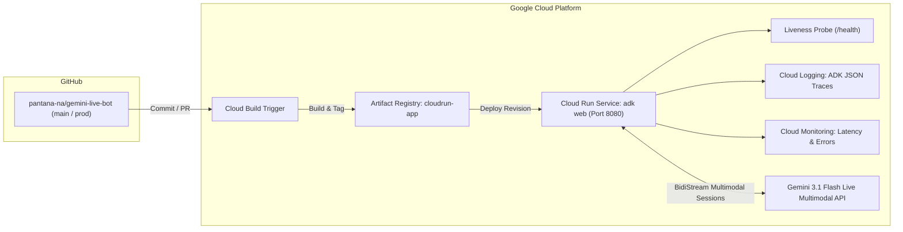

# Gemini Live Bot: Technical System Architecture

> Multimodal Voice-First Intelligent Customer Service Platform with Google ADK, Gemini 3.1 Flash Preview, Decentralized Sub-Agent Coordination, and Deterministic State Machine Guardrails.

- **Status:** Designed & Specified
- **Target Foundation Model:** `gemini-3.1-flash-live-preview` (Gemini Multimodal Live BidiStream via Google AI Studio API Key)
- **Agent Framework:** Google Agent Development Kit (`google-adk v2.8.0`) & `adk web`
- **Primary Language:** Thai (ภาษาไทย)
- **Interactive Companion Diagram:** [`docs/gemini-live-bot-architecture.html`](./gemini-live-bot-architecture.html)

---

## 1. High-Level Architecture Overview

```
+----------------------------------------------------------------------------------------------------+
|                         CLIENT TIER: GOOGLE ADK WEB CONSOLE (/dev-ui/)                             |
|                                                                                                    |
|    +----------------------------------+            +------------------------------------------+    |
|    |      Voice / Text Input          |            |         Audio / Text Output              |    |
|    |      Real-time Multimodal Input  |            |         Low-latency streaming responses  |    |
|    |      Session & Trace Inspector   |            |         Agent Handoff & Tool Badges      |    |
|    +-----------------+----------------+            +--------------------+---------------------+    |
+----------------------|--------------------------------------------------|--------------------------+
                       |                                                  ^
                       | ADK Event Stream & Bidirectional Session         |
                       v                                                  |
+----------------------------------------------------------------------------------------------------+
|                    GOOGLE ADK WEB RUNTIME (adk web / Port 8000 local, Port 8080 Cloud Run)         |
|                                                                                                    |
|    +------------------------------------------------------------------------------------------+    |
|    |  ADK Multi-Agent Session Manager                                                         |    |
|    |  - Manages session lifecycle, tool declarations, and context state injection             |    |
|    |  - ToolContext State: auth_fail_count, customer_id, customer_name, session_stage         |    |
|    +------------------------------------------------------------------------------------------+    |
|                                              |                                                     |
|                                              v                                                     |
|    +------------------------------------------------------------------------------------------+    |
|    |  Gemini Live Multimodal Engine (gemini-3.1-flash-live-preview)                           |    |
|    |  - Dedicated Voice Profiles: Aoede (ฝน), Kore (ก้อย), Charon (ไอติม)                     |    |
|    |  - Real-time Function Calling & Autonomous Tool Execution Loop                           |    |
|    +------------------------------------------------------------------------------------------+    |
+----------------------------------------------|-----------------------------------------------------+
                                               |
                                               v
+----------------------------------------------------------------------------------------------------+
|                              DECENTRALIZED MULTI-AGENT COORDINATION TIER                           |
|                                                                                                    |
|   +--------------------------------------------------------------------------------------------+   |
|   |  Root Orchestrator Agent (thai_customer_orchestrator / ฝน - Voice: Aoede)                  |   |
|   |  - Role: Front-desk greeting, customer authentication & immediate domain transfer         |   |
|   |  - Verifies: Name + Birthdate against 20-profile Customer DB (3-attempt lockout gate)      |   |
|   |  - Zero-Redundancy Handoff: Immediate programmatic transfer to flight or complaint agent  |   |
|   +-------------------+------------------------------------------+-----------------------------+   |
|                       |                                          |                                 |
|                       | Initial Domain Transfer                  | Initial Domain Transfer         |
|                       v                                          v                                 |
|   +---------------------------------------+  Peer Transfer   +---------------------------------+   |
|   | Flight Booking Agent (ก้อย - Kore)    | ◄──────────────► | Complaint Agent (ไอติม - Charon)|   |
|   | (flight_booking_agent)                |                  | (complaint_agent)               |   |
|   | - Search & confirm flights (Top 3)    |                  | - Empathetic grievance intake   |   |
|   | - Confirms & issues PNR booking code  |                  | - Issues Ticket ID & SLA notice |   |
|   | - Follow-up Inquiry: "มีบริการอื่นใด   |                  | - Follow-up Inquiry: "มีบริการ  |   |
|   |   ให้ก้อยช่วยดูแลเพิ่มเติมไหมคะ?"      |                  |   อื่นให้ไอติมช่วยดูแลไหมครับ?" |   |
|   +-------------------+-------------------+                  +----------------+----------------+   |
|                       |                                                       |                    |
|                       +───────────────────────────┬───────────────────────────+                    |
|                                                   │                                                |
|                                                   v                                                |
|                                  +---------------------------------+                               |
|                                  | route_customer_followup()       |                               |
|                                  | (Deterministic Intent Classifier│                               |
|                                  |  via app/intent_lexicon.py)     |                               |
|                                  +----------------+----------------+                               |
|                                                   │                                                |
|                   ┌───────────────────────────────┼───────────────────────────────┐                |
|                   ▼                               ▼                               ▼                |
|   +-------------------------------+   +-----------------------+   +----------------------------+   |
|   | Peer Transfer to Other Sub    |   | Same-Domain Continued |   | Polite Call Termination    |   |
|   | (transfer_to_agent)           |   | (CONTINUE_CURRENT)    |   | (terminate_call)           |   |
|   | - flight -> complaint         |   | - Another flight      |   | 1. SESSION_COMPLETED (Bye) |   |
|   | - complaint -> flight         |   | - Another complaint   |   | 2. OUT_OF_SCOPE_INTENT     |   |
|   +-------------------------------+   +-----------------------+   +----------------------------+   |
+---------------------------------------------------|------------------------------------------------+
                                                    v
+----------------------------------------------------------------------------------------------------+
|                                        DATA & PERSISTENCE TIER                                     |
|                                                                                                    |
|    +--------------------------+    +--------------------------+    +--------------------------+    |
|    |   Customer Mock DB       |    |   Mock Flight Store      |    |   Complaint Ticket DB    |    |
|    |   (20 Thai Profiles)     |    |   (Carrier Simulation)   |    |    (Issue Resolution)    |    |
|    |   - ID, Thai/EN Name     |    |   - TG, PG, FD, DD       |    |   - Ticket ID            |    |
|    |   - Birthdate (B.E./C.E.)|    |   - Route Multiplier     |    |   - Category & Severity  |    |
|    |   - Loyalty Tier & Phone |    |   - Booking PNR Ledger   |    |   - Status & Timestamps  |    |
|    +--------------------------+    +--------------------------+    +--------------------------+    |
+----------------------------------------------------------------------------------------------------+
```

---

## 2. Component Detail & Interaction Specifications

### 2.1 Runtime & Delivery
- **Server Runtime:** Official Google Agent Development Kit Web Server (`adk web .`).
- **Interactive UI:** Served at `/dev-ui/` with built-in trace inspection, tool logs, and agent handoff indicators.
- **Port Strategy:** Port 8000 for local development, Port 8080 on Google Cloud Run via `Dockerfile`.
- **Health Endpoint:** Standard ADK `/health` endpoint for Cloud Run container liveness probes.

### 2.2 Decentralized Sub-Agent Coordination & Concierge Workflow
- **State Preservation:** When `thai_customer_orchestrator` transfers control, customer authentication details (`customer_id`, `name_th`, `loyalty_tier`) are persisted in `tool_context.state`.
- **Identity Fallback:** Sub-agents automatically inherit authenticated identity from `tool_context.state` without requesting the customer repeat their details.
- **Autonomous Sub-Agent Coordination:** Upon completing their respective domain tasks (flight confirmed or complaint logged):
  1. Sub-agents verbally confirm the task outcome with their own voice (PNR reference code or Ticket ID + SLA).
  2. Sub-agents ask the customer directly: *"มีบริการอื่นใดให้[ชื่อเจ้าหน้าที่]ช่วยดูแลเพิ่มเติมอีกไหมคะ/ครับ?"*
  3. The customer's answer is evaluated deterministically by calling `route_customer_followup(customer_response=...)`.
- **Deterministic Follow-Up Routing (`route_customer_followup`):**
  - **Peer Transfer:** Seamlessly transfers laterally between `flight_booking_agent` and `complaint_agent` via `tool_context.actions.transfer_to_agent`.
  - **Continued Service:** Keeps conversation within the active agent if the user requests additional tasks in the same domain.
  - **Graceful Termination:** Terminates politely via `terminate_call` when the user confirms completion (`SESSION_COMPLETED`) or asks for unsupported tasks (`OUT_OF_SCOPE_INTENT`).

### 2.3 Unified Intent Lexicon (`app/intent_lexicon.py`)
- Single canonical dictionary (`COMPLAINT_KEYWORDS`, `FLIGHT_KEYWORDS`, `COMPLETION_KEYWORDS`, `CLARIFICATION_KEYWORDS`).
- Common classifier `detect_customer_intent(text)` shared across `authenticate_customer` and `route_customer_followup`.
- Complaint intent is evaluated before flight keywords to prevent false-positives when flight terms appear in complaint descriptions.

---

## 3. DevOps, Observability & Cloud Deployment Topology



---

## 4. Architectural Invariants

1. **Zero Unauthenticated Bookings:** `flight_booking_agent` requires a verified customer session before executing final booking.
2. **Bounded Authentication Gate:** $\ge 3$ failed verification attempts strictly triggers `terminate_call(reason="AUTH_FAILURE_EXCEEDED")` with polite explanation.
3. **Strict Scope Gate:** Out-of-scope or unauthorized requests strictly trigger `terminate_call(reason="OUT_OF_SCOPE_INTENT")` with polite refusal.
4. **Deterministic Top 3:** Flight recommendations must return exactly 3 ranked choices when 3 or more flights are available.
5. **Universal Empathy Standard:** `complaint_agent` must acknowledge customer inconvenience in polite Thai before capturing problem taxonomy.
6. **Decentralized Concierge Re-engagement:** Sub-agents conduct follow-up inquiry directly using `route_customer_followup`, routing laterally to peer sub-agents or terminating gracefully without unnecessary bounce-back to root.
7. **Canonical Intent Symmetry:** Intent classification in the root orchestrator (`authenticate_customer`) and sub-agents (`route_customer_followup`) must use the identical canonical lexicon in `app/intent_lexicon.py`.
