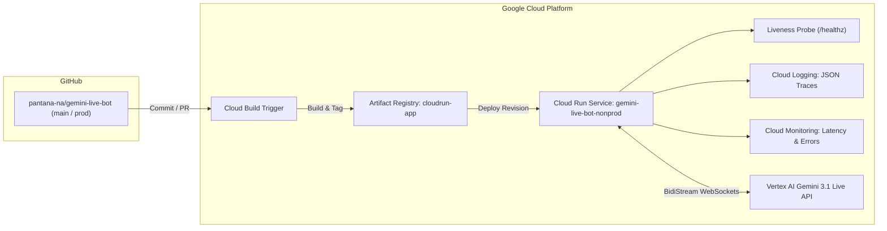

# Gemini Live Bot: Technical System Architecture

> Multimodal Voice-First Intelligent Customer Service Platform with Google ADK, Gemini 3.1 Flash Preview, and Hierarchical Multi-Agent Delegation.

- **Status:** Designed & Specified
- **Target Foundation Model:** `gemini-3.1-flash-live-preview` (Gemini Multimodal Live BidiStream via Google AI Studio API Key)
- **Agent Framework:** Google Agent Development Kit (`google-adk v2.8.0`) & `agents-cli`
- **Primary Language:** Thai (ภาษาไทย)
- **Interactive Companion Diagram:** [`docs/gemini-live-bot-architecture.html`](./gemini-live-bot-architecture.html)

---

## 1. High-Level Architecture Overview

```
+----------------------------------------------------------------------------------------------------+
|                      CUSTOMER CLIENT TIER: INTERACTIVE VOICE WEB CONSOLE (Port 8080)               |
|                                                                                                    |
|    +----------------------------------+            +------------------------------------------+    |
|    |      Voice Input (Microphone)    |            |         Audio Output (Speaker)           |    |
|    |      16kHz Mono PCM Audio Worklet|            |         Low-latency streaming chunks     |    |
|    |      Canvas Waveform Oscilloscope|            |         Live Transcript & Status Badges  |    |
|    +-----------------+----------------+            +--------------------+---------------------+    |
+----------------------|--------------------------------------------------|--------------------------+
                       |                                                  ^
                       | WebSocket Bidirectional Audio & JSON Stream      |
                       v                                                  |
+----------------------------------------------------------------------------------------------------+
|                              ADK FASTAPI ORCHESTRATION LAYER (Port 8080)                           |
|                                                                                                    |
|    +------------------------------------------------------------------------------------------+    |
|    |  ADK Live Runner & Session Manager                                                        |    |
|    |  - Manages WebSocket lifecycle, audio frame chunking, and session context retention      |    |
|    |  - State: authenticated_user, customer_id, intent_stage, active_subagent                 |    |
|    +------------------------------------------------------------------------------------------+    |
|                                              |                                                     |
|                                              v                                                     |
|    +------------------------------------------------------------------------------------------+    |
|    |  Gemini Live Multimodal Engine (gemini-3.1-flash-live-preview via API Key)               |    |
|    |  - Real-time Audio-to-Audio reasoning & Speech-to-Speech synthesis in Thai                 |    |
|    |  - Integrated Function Calling & Tool Execution Loop                                     |    |
|    +------------------------------------------------------------------------------------------+    |
+----------------------------------------------|-----------------------------------------------------+
                                               |
                                               v
+----------------------------------------------------------------------------------------------------+
|                                    MULTI-AGENT DELEGATION TIER                                     |
|                                                                                                    |
|   +--------------------------------------------------------------------------------------------+   |
|   |  Root Orchestrator Agent (thai_customer_orchestrator)                                      |   |
|   |  - Role: Front-desk greeting, customer authentication & continuous concierge loop         |   |
|   |  - Verifies: Name + Birthdate against 20-profile Customer DB (Bounded at 3 attempts)       |   |
|   |  - Intent Detection: Routes to Flight Booking or Complaint Agent                          |   |
|   |  - Concierge Follow-up: "คุณ{name} มีบริการอื่นใดให้ทางเราช่วยดูแลเพิ่มเติมอีกไหมครับ/ค่ะ?" |   |
|   |  - Guardrails: Politely terminates on 3 auth failures, out-of-scope requests, or done      |   |
|   +-------------------+------------------------------+---------------------+-------------------+   |
|                       |                              |                     |                       |
|                       | Intent: flight_booking       | Intent: complaint   | Guardrail Triggers    |
|                       v                              v                     v                       |
|   +---------------------------------------+  +------------------------+  +---------------------+   |
|   | Flight Booking Agent (ก้อย)           |  | Complaint Agent (ไอติม)|  | Call Control Tool   |   |
|   | (flight_booking_agent)                |  | (complaint_agent)      |  | (terminate_call)    |   |
|   | - Collects: Origin, Dest, Dates       |  | - Genuine empathy      |  | 1. AUTH_FAILURE_    |   |
|   | - Action: Mock Flight Engine          |  | - Situation overview   |  |    EXCEEDED (Polite)|   |
|   | - Presents: Top 3 curated options     |  | - Generates Ticket ID  |  | 2. OUT_OF_SCOPE_    |   |
|   | - Books: Confirms & issues PNR code   |  | - SLA timeframe note   |  |    INTENT (Polite)  |   |
|   | - Loopback: Returns to Root           |  | - Loopback: Returns    |  | 3. SESSION_         |   |
|   +-------------------+-------------------+  +-----------+------------+  |    COMPLETED (Fare- |   |
|                       |                                  |               |    well & Hangup)   |   |
|                       +----------------> <---------------+               +---------------------+   |
|                                        |                                                           |
|                                        v (Task Complete: Return to Root for Next Service Inquiry)  |
|                       +----------------------------------+                                         |
|                       | Root (ฝน): "มีบริการอื่นใด       |                                         |
|                       |  ให้ช่วยดูแลเพิ่มเติมไหมคะ?"     |                                         |
|                       +----------------------------------+                                         |
+----------------------------------------------------------------------------------------------------+
                        |                                  |
                        v                                  v
+----------------------------------------------------------------------------------------------------+
|                                        DATA & PERSISTENCE TIER                                     |
|                                                                                                    |
|    +--------------------------+    +--------------------------+    +--------------------------+    |
|    |   Customer Mock DB       |    |   Mock Flight Store      |    |   Complaint Ticket DB    |    |
|    |   (20 Thai Profiles)     |    |   (Carrier Simulation)   |    |    (Issue Resolution)    |    |
|    |   - ID, Thai/EN Name     |    |   - TG, PG, FD, DD       |    |   - Ticket ID            |    |
|    |   - Birthdate (B.E./C.E.)|    |   - Route Multiplier     |    |   - Category & Severity  |    |
|    |   - Loyalty Tier & Phone |    |   - Booking PNR Ledger   |    |   - Status & Timestamps  |    |
|    +--------------------------+    +--------------------------+    +--------------------------+    |
+----------------------------------------------------------------------------------------------------+
+----------------------------------------------------------------------------------------------------+
```

---

## 2. Component Detail & Interaction Specifications

### 2.1 Audio & Streaming Protocol
- **Transport:** WebSocket over TLS (`wss://`) terminating on Cloud Run FastAPI service.
- **Payload Format:** 16,000 Hz, 16-bit linear PCM mono audio input; 24,000 Hz PCM audio output.
- **Model Endpoint:** Gemini Developer API Multimodal Live streaming endpoint using `gemini-3.1-flash-live-preview` (authenticated via `GEMINI_API_KEY` with Vertex AI toggle support).
- **Latency Optimization:** Direct streaming chunking; function calling execution happens in an asynchronous event loop without dropping the voice channel.

### 2.2 Agent Delegation, Concierge Loop & Guardrail Terminations
- **State Preservation:** When `thai_customer_orchestrator` transfers control to `flight_booking_agent` or `complaint_agent`, customer authentication details (`customer_id`, `name_th`, `loyalty_tier`) are passed in `Session.state`.
- **Context Injection:** Sub-agents inherit the conversational memory and greeting context so the customer does not have to repeat their identity.
- **Continuous Concierge Loop:** Upon task completion by a sub-agent (flight confirmed or complaint logged), conversation control yields back to `thai_customer_orchestrator`, which immediately prompts: *"คุณ{name} มีบริการอื่นใดให้ทางเราช่วยดูแลเพิ่มเติมอีกไหมครับ/ค่ะ?"*. The loop repeats continuously until the customer confirms completion or requests an out-of-scope task.
- **Dual Polite Guardrail Terminations (`terminate_call`):**
  1. *3-Strike Auth Failure (`AUTH_FAILURE_EXCEEDED`):* If identity cannot be verified within 3 attempts, orchestrator politely explains the account security limit, bids farewell in Thai, and cleanly disconnects.
  2. *Out-of-Scope Intent (`OUT_OF_SCOPE_INTENT`):* If customer asks for unsupported or prohibited services, orchestrator politely refuses in Thai, clarifies scope, bids farewell, and cleanly disconnects.
  3. *Graceful Completion (`SESSION_COMPLETED`):* When customer indicates all requests are fulfilled ("ไม่มีแล้ว / ขอบคุณครับ"), orchestrator offers a warm travel wish, bids farewell, and cleanly disconnects.

### 2.3 Data Stores & Search Grounding
1. **Mock Customer Store (20 Records):**
   - Realistic Thai naming distribution and Buddhist calendar birthdate conversion.
   - Dual-language matching (Thai script & English romanization).
2. **Mock Flight Discovery Engine (`search_real_flights`):**
   - Simulated carrier schedule and fare generator based on 4 representative airlines (Thai Airways, Bangkok Airways, Thai AirAsia, Nok Air).
   - Dynamic route multiplier (5.5x for international destinations) and Top-3 selection algorithm.
   - Confirmed bookings recorded to in-memory PNR ledger.
3. **Mock Complaint Ticket Store:**
   - Sequential ticket generation: `TKT-YYYYMMDD-XXXX`.
   - Category mapping: Flight Delay, Baggage, In-flight Service, Ticketing, Ground Staff.

---

## 3. DevOps, Observability & Cloud Deployment Topology



---

## 4. Architectural Invariants
1. **Zero Unauthenticated Bookings:** `flight_booking_agent` requires a verified customer session before executing final booking.
2. **Bounded Authentication Gate:** $\ge 3$ failed verification attempts strictly triggers `terminate_call(reason="AUTH_FAILURE_EXCEEDED")` with polite explanation.
3. **Strict Scope Gate:** Out-of-scope or unauthorized requests strictly trigger `terminate_call(reason="OUT_OF_SCOPE_INTENT")` with polite refusal.
4. **Deterministic Top 3:** Flight recommendations must return exactly 3 ranked choices when 3 or more flights are available.
5. **Universal Empathy Standard:** `complaint_agent` must acknowledge customer inconvenience in polite Thai before capturing problem taxonomy.
6. **Continuous Concierge Re-engagement:** Sub-agent completion strictly transfers control back to the root orchestrator for follow-up inquiry until the customer concludes (`SESSION_COMPLETED`).
