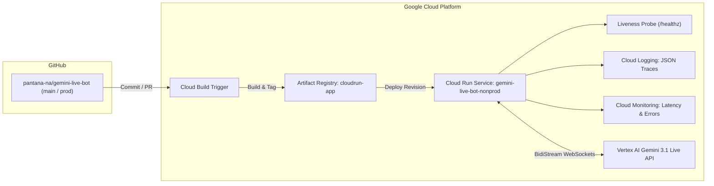

# Gemini Live Bot: Technical System Architecture

> Multimodal Voice-First Intelligent Customer Service Platform with Google ADK, Gemini 3.1 Flash Preview, and Hierarchical Multi-Agent Delegation.

- **Status:** Designed & Specified
- **Target Foundation Model:** `gemini-3.1-flash-preview` (Gemini Multimodal Live BidiStream)
- **Agent Framework:** Google Agent Development Kit (`google-adk v2.3.0`) & `agents-cli`
- **Primary Language:** Thai (ภาษาไทย)
- **Interactive Companion Diagram:** [`docs/gemini-live-bot-architecture.html`](./gemini-live-bot-architecture.html)

---

## 1. High-Level Architecture Overview

```
+----------------------------------------------------------------------------------------------------+
|                                      CUSTOMER CLIENT TIER                                          |
|                                                                                                    |
|    +----------------------------------+            +------------------------------------------+    |
|    |      Voice Input (Microphone)    |            |         Audio Output (Speaker)           |    |
|    |      16kHz / 24kHz PCM Audio     |            |         Low-latency streaming chunks     |    |
|    +-----------------+----------------+            +--------------------+---------------------+    |
+----------------------|--------------------------------------------------|--------------------------+
                       |                                                  ^
                       | WebSocket Bidirectional Audio Stream             |
                       v                                                  |
+----------------------------------------------------------------------------------------------------+
|                              ADK FASTAPI ORCHESTRATION LAYER (Port 8080)                           |
|                                                                                                    |
|    +------------------------------------------------------------------------------------------+    |
|    |  ADK Live Runner & Session Manager                                                        |    |
|    |  - Manages WebSocket lifecycle, audio frame chunking, and session context retention      |    |
|    |  - State: authenticated_user, customer_id, intent_stage, active_subagent                 |    |
|    +------------------------------------------------------------------------------------------+    |
|                                              |                                                     |
|                                              v                                                     |
|    +------------------------------------------------------------------------------------------+    |
|    |  Vertex AI Gemini Multimodal Live API (gemini-3.1-flash-preview)                         |    |
|    |  - Real-time Audio-to-Audio reasoning & Speech-to-Speech synthesis in Thai                 |    |
|    |  - Integrated Function Calling & Tool Execution Loop                                     |    |
|    +------------------------------------------------------------------------------------------+    |
+----------------------------------------------|-----------------------------------------------------+
                                               |
                                               v
+----------------------------------------------------------------------------------------------------+
|                                    MULTI-AGENT DELEGATION TIER                                     |
|                                                                                                    |
|   +--------------------------------------------------------------------------------------------+   |
|   |  Root Orchestrator Agent (thai_customer_orchestrator)                                      |   |
|   |  - Role: Front-desk greeting & customer authentication in polite Thai                      |   |
|   |  - Verifies: Name + Birthdate against Customer DB                                          |   |
|   |  - Intent Detection: Routes to Flight Booking or Complaint Agent                          |   |
|   +------------------------------+------------------------------+------------------------------+   |
|                                  |                              |                                  |
|                                  | Intent: flight_booking       | Intent: complaint_issue          |
|                                  v                              v                                  |
|   +---------------------------------------------+  +-------------------------------------------+   |
|   | Flight Booking Agent (flight_booking_agent) |  | Complaint Agent (complaint_agent)         |   |
|   | - Collects: Origin, Destination, Dates      |  | - Active listening with genuine empathy   |   |
|   | - Action: Searches flight database/Google   |  | - Captures: Situation overview, timestamp |   |
|   | - Presents: Top 3 curated flight choices    |  | - Generates: Incident ticket reference    |   |
|   | - Books: Issues confirmed PNR reference     |  | - SLA: Provides resolution timeframe      |   |
|   +----------------------+----------------------+  +--------------------+----------------------+   |
+--------------------------|-----------------------------------------------|-------------------------+
                           |                                               |
                           v                                               v
+----------------------------------------------------------------------------------------------------+
|                                        DATA & PERSISTENCE TIER                                     |
|                                                                                                    |
|    +--------------------------+    +--------------------------+    +--------------------------+    |
|    |   Customer Mock DB       |    |     Flight Mock DB       |    |   Complaint Ticket DB    |    |
|    |   (20 Thai Profiles)     |    |   (Routes & Schedules)   |    |    (Issue Resolution)    |    |
|    |   - ID, Thai/EN Name     |    |   - TG, PG, FD Routes    |    |   - Ticket ID            |    |
|    |   - Birthdate (B.E./C.E.)|    |   - Fares (THB) & Seats  |    |   - Category & Severity  |    |
|    |   - Loyalty Tier & Phone |    |   - Confirmed Bookings   |    |   - Status & Timestamps  |    |
|    +--------------------------+    +--------------------------+    +--------------------------+    |
+----------------------------------------------------------------------------------------------------+
```

---

## 2. Component Detail & Interaction Specifications

### 2.1 Audio & Streaming Protocol
- **Transport:** WebSocket over TLS (`wss://`) terminating on Cloud Run FastAPI service.
- **Payload Format:** 16,000 Hz, 16-bit linear PCM mono audio input; 24,000 Hz PCM audio output.
- **Model Endpoint:** Vertex AI Gemini Multimodal Live streaming endpoint using `gemini-3.1-flash-preview`.
- **Latency Optimization:** Direct streaming chunking; function calling execution happens in an asynchronous event loop without dropping the voice channel.

### 2.2 Agent Delegation & Session Transfer
- **State Preservation:** When `thai_customer_orchestrator` transfers control to `flight_booking_agent` or `complaint_agent`, customer authentication details (`customer_id`, `name_th`, `loyalty_tier`) are passed in `Session.state`.
- **Context Injection:** Sub-agents inherit the conversational memory and greeting context so the customer does not have to repeat their identity.

### 2.3 Mock Data Stores (In-Memory MVP)
1. **Mock Customer Store (20 Records):**
   - Realistic Thai naming distribution and Buddhist calendar birthdate conversion.
   - Dual-language matching (Thai script & English romanization).
2. **Mock Flight Engine:**
   - Multi-airline schedule generator (Thai Airways, Bangkok Airways, AirAsia).
   - Top-3 selection algorithm prioritizing price and schedule convenience.
3. **Mock Complaint Ticket Store:**
   - Sequential ticket generation: `TKT-YYYYMMDD-XXXX`.
   - Category mapping: Flight Delay, Baggage, In-flight Service, Ticketing, Ground Staff.

---

## 3. DevOps, Observability & Cloud Deployment Topology



---

## 4. Architectural Invariants
1. **Zero Unauthenticated Bookings:** `flight_booking_agent` requires a verified customer session before executing final booking.
2. **Deterministic Top 3:** Flight recommendations must return exactly 3 ranked choices when 3 or more flights are available.
3. **Universal Empathy Standard:** `complaint_agent` must acknowledge customer inconvenience in polite Thai before capturing problem taxonomy.
