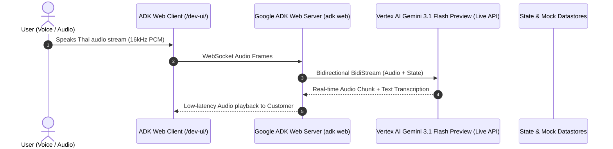

# Baseline System Overview: Gemini Live Bot Platform

## 1. System Context & Baseline Architecture

The **Gemini Live Bot** repository is an enterprise-grade, voice-first intelligent customer engagement platform built on Google Cloud, utilizing **Google Agent Development Kit (ADK v2.3.0)**, **Google Agents CLI (`agents-cli v1.1.0`)**, and the **Gemini Multimodal Live API (`gemini-3.1-flash-preview`)**.

### Current Baseline Inventory

| Component | Technology | Version / Spec | Description |
| :--- | :--- | :--- | :--- |
| **Agent Framework** | Google ADK (`google-adk`) | 2.3.0 | Native Python agent orchestration with bidirectional streaming and sub-agent delegation. |
| **Agent CLI** | Google Agents CLI (`agents-cli`) | 1.1.0 | Project scaffolding, evaluation, and lifecycle management. |
| **Runtime Environment** | Python (via `uv`) | 3.13.15 | Isolated virtualenv and modern packaging. |
| **AI Foundation Model** | Gemini Multimodal Live | `gemini-3.1-flash-preview` | Low-latency audio-in / audio-out bidirectional streaming with function calling. |
| **Deployment Platform** | Vertex AI Agent Engine (`reasoningEngines`) | Enterprise | Managed Gemini Enterprise Agent Platform runtime deployed via `agents-cli deploy`. |
| **Local Web Runner** | Google ADK Web Server (`adk web`) | 2.8.0 | Multimodal local dev web runner serving interactive UI, session management, and /health probe (Port 8000). |
| **Configuration Governance** | Unified Multi-Environment | Rule 8 Compliant | Single `.env`, `.env.example`, and `agents-cli-manifest.yaml` managing parameters. |
| **Version Control** | GitHub Repository | `pantana-na/gemini-live-bot` | Multi-branch trunk-based branching model (`main` vs `prod`). |

---

## 2. Directory Structure Baseline

```
gemini-live-bot/
├── .env                              # Active environment configuration (gitignored)
├── .env.example                      # Centralized multi-environment template (Rule 8)
├── .gitignore                        # Standard SCM ignore patterns
├── AGENTS.md                         # Operational agent manual and pointer index
├── GEMINI.md                         # Project governance, SDD mandate, and 10 DevOps rules
├── _agents/                          # Jetski agent customizations
│   ├── rules/
│   │   ├── spec_driven_development.md
│   │   └── devops_security_and_quality_standards.md
│   └── skills/
│       ├── architecture_diagram/
│       ├── codemender/
│       └── gcp_cost_estimator/
├── docs/                             # Operational reports, security audits, diagrams
│   └── README.md
└── specs/                            # Spec-Driven Development (SDD) registry
    ├── README.md
    ├── baseline/
    │   └── system-overview.md        # [This document]
    ├── features/                     # Feature specification documents
    ├── plan/                         # Living progress tracking and execution metrics
    └── templates/
        └── sdd-template.md           # Formal SDD template
```

---

## 3. Communication & Runtime Flow Baseline



---

## 4. Key Invariants & Baseline Constraints

1. **Strict Audio Latency Bound:** Live speech input must stream directly to Gemini Live API without intermediate blocking disk I/O.
2. **Deterministic Authentication:** Customer identity verification requires an exact match on Thai name (or transliteration) and birthdate against the database before sensitive actions can be performed.
3. **Session State Isolation:** User profile and authentication status must persist in the ADK `Session.state` across sub-agent transfers (`root_agent` -> `flight_booking_agent` / `complaint_agent`).
4. **Empathetic Thai Dialogue:** Thai linguistic tone particles (`ครับ`/`ค่ะ`) and politeness registers must remain consistent throughout the dialogue.
