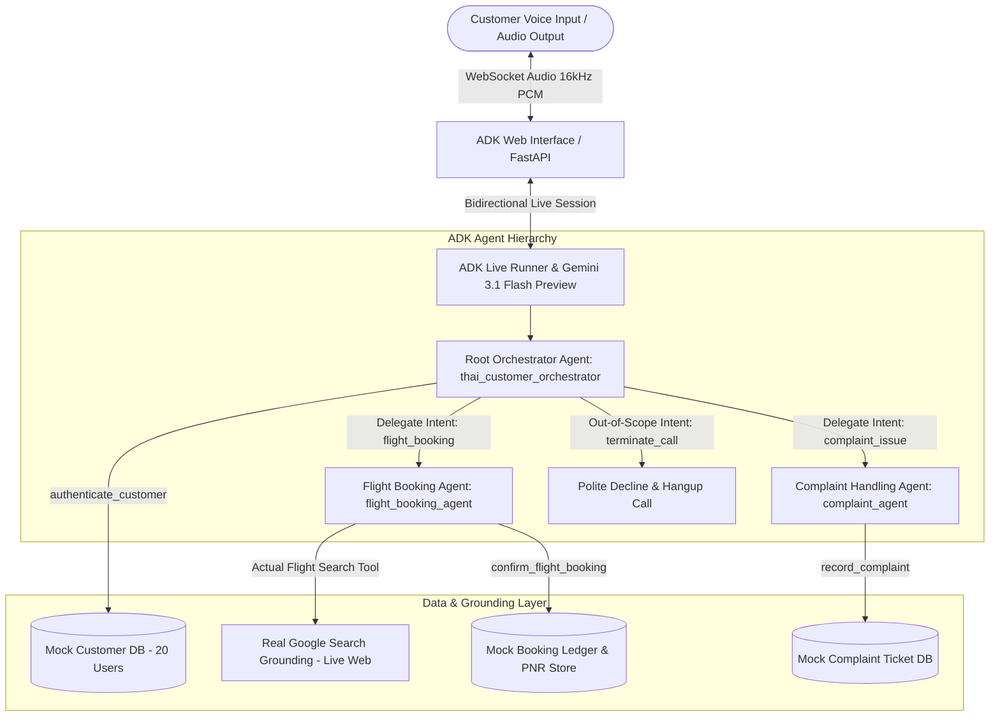
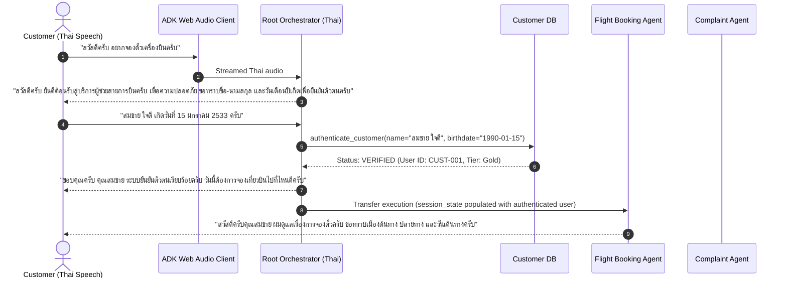
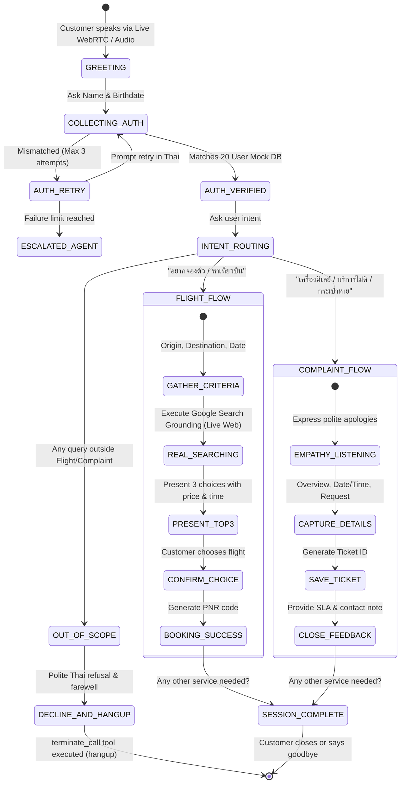

# Specification: [SPEC-20260907-GEMINI-LIVE-ADK-THAI-VOICE-AGENT]
# Multimodal Gemini Live Thai Voice Agent Platform with Google ADK

## 1. Problem Statement & Objectives

### 1.1 Context & Motivation
Modern contact centers and customer service interfaces struggle with rigid IVR trees and sluggish turn-based chatbots. Customers calling airlines or travel service desks in Thailand face frustrating wait times, fragmented verification steps, and unnatural automated responses. 

By leveraging **Google Agent Development Kit (ADK v2.3.0)**, **Google Agents CLI (`agents-cli`)**, and the latest **Gemini Multimodal Live API (`gemini-3.1-flash-preview`)**, this project delivers a real-time, bidirectional voice-enabled customer service platform operating natively in **Thai**. The architecture features a hierarchical multi-agent structure orchestrated by a root agent, delegating domain tasks to specialized sub-agents for flight booking and complaint resolution while maintaining conversation context and identity authentication.

### 1.2 Goals
- **Real-Time Voice Interaction:** Low-latency bidirectional audio streaming using `gemini-3.1-flash-preview` over WebSockets.
- **Natural Thai Conversational Experience:** Professional, polite Thai service register (สุภาพ เป็นธรรมชาติ ใช้หางเสียง ครับ/ค่ะ เหมาะสม) across all agent personas.
- **Hierarchical Multi-Agent Architecture:**
  - `root_agent` (Orchestrator & Auth): Welcomes customer, authenticates identity against a customer database (matching name and birthdate), detects user intent, and seamlessly delegates to sub-agents.
    - **Strict Scope Enforcement & Polite Hangup:** If the customer's intent does not match the 2 supported capabilities (flight booking or complaints), the orchestrator strictly declines to participate, explains its limited scope politely in Thai, bids farewell, and terminates/hangs up the call (`terminate_call`).
  - `flight_booking_agent`: Gathers departure/arrival locations and dates, executes **actual real-time Google Search grounding (no mock flights)** to retrieve live schedules and fares, curates the Top 3 options, and confirms flight booking.
  - `complaint_agent`: Empathizes with user grievance, captures incident situation overview and timestamp, categorizes issue severity, and generates ticket records.
- **Mock Data Layer:**
  - Mock Customer Store with 20 realistic Thai profiles (Thai names, English transliterations, birthdates, tier status).
  - Mock Complaint Ticket Store tracking resolution status and incident telemetry.
  - Mock Booking Confirmation Ledger recording confirmed PNR reservations (while flight discovery itself runs on actual Google Search).
- **Enterprise DevOps & Security Compliance:** 100% alignment with the 10 SDD DevSecOps standards (unified `.env`, Cloud Run readiness, property testing, and SAST).

### 1.3 Non-Goals
- Real payment gateway integration (e.g., credit card processing) for this MVP phase.
- Multi-lingual cross-switching outside of Thai and English transliteration during this phase.
- Direct live telephony PSTN/SIP trunk termination (interfacing is done via WebRTC/WebSocket audio in ADK Web).

---

## 2. System Architecture & Component Interaction

### 2.1 Multi-Agent Topology



### 2.2 Sequence Flow: Customer Greeting, Authentication & Delegation



---

## 3. Data Models & Type Contracts

All data structures are defined in Python using `pydantic.BaseModel` and standard typing contracts.

### 3.1 Customer & Authentication Schema

```python
from pydantic import BaseModel, Field
from typing import Optional, List
from datetime import date

class CustomerProfile(BaseModel):
    customer_id: str = Field(..., description="Unique customer ID (e.g. CUST-001)")
    name_th: str = Field(..., description="Full name in Thai script")
    name_en: str = Field(..., description="Full name transliterated in English")
    birthdate: date = Field(..., description="Date of birth (YYYY-MM-DD)")
    phone_number: str = Field(..., description="Contact telephone number")
    email: str = Field(..., description="Customer email address")
    loyalty_tier: str = Field(default="Standard", description="Loyalty tier: Standard, Silver, Gold, Platinum")

class AuthResult(BaseModel):
    is_authenticated: bool = Field(..., description="True if credentials matched successfully")
    customer_id: Optional[str] = Field(None, description="Customer ID if verified")
    customer_name: Optional[str] = Field(None, description="Customer full name")
    loyalty_tier: Optional[str] = Field(None, description="Loyalty tier")
    message: str = Field(..., description="Status message in Thai")
```

### 3.2 Flight Search, Ranking & Booking Schema

```python
from enum import Enum

class CabinClass(str, Enum):
    ECONOMY = "Economy"
    PREMIUM_ECONOMY = "Premium Economy"
    BUSINESS = "Business"

class FlightOption(BaseModel):
    flight_number: str = Field(..., description="Airline flight code (e.g. TG642)")
    airline: str = Field(..., description="Airline carrier name")
    departure_city: str = Field(..., description="Departure city or airport name")
    arrival_city: str = Field(..., description="Arrival city or airport name")
    departure_time: str = Field(..., description="Departure time in format HH:MM")
    arrival_time: str = Field(..., description="Arrival time in format HH:MM")
    departure_date: str = Field(..., description="Date of departure (YYYY-MM-DD)")
    price_thb: float = Field(..., description="Ticket price in Thai Baht (THB)")
    cabin_class: CabinClass = Field(default=CabinClass.ECONOMY)
    available_seats: int = Field(..., description="Number of remaining seats")

class FlightSearchParams(BaseModel):
    departure_city: str = Field(..., description="Origin city/airport")
    arrival_city: str = Field(..., description="Destination city/airport")
    departure_date: str = Field(..., description="Date of travel (YYYY-MM-DD)")
    return_date: Optional[str] = Field(None, description="Optional return date")

class FlightBookingConfirmation(BaseModel):
    booking_reference: str = Field(..., description="6-character PNR reference code (e.g. TH9284)")
    customer_id: str = Field(..., description="Booked customer identifier")
    flight_number: str = Field(..., description="Confirmed flight code")
    passenger_name: str = Field(..., description="Passenger name")
    total_price_thb: float = Field(..., description="Total confirmed price in THB")
    booking_status: str = Field(default="CONFIRMED", description="CONFIRMED | PENDING | CANCELLED")
```

### 3.3 Complaint & Grievance Schema

```python
from datetime import datetime

class ComplaintSeverity(str, Enum):
    LOW = "LOW"
    MEDIUM = "MEDIUM"
    HIGH = "HIGH"
    CRITICAL = "CRITICAL"

class ComplaintCategory(str, Enum):
    FLIGHT_DELAY = "ความล่าช้าของเที่ยวบิน"
    LOST_BAGGAGE = "สัมภาระสูญหายหรือเสียหาย"
    INFLIGHT_SERVICE = "การบริการบนเที่ยวบิน"
    TICKETING_REFUND = "ปัญหาการจองตั๋วหรือคืนเงิน"
    GROUND_STAFF = "การบริการของเจ้าหน้าที่ภาคพื้น"
    OTHER = "อื่นๆ"

class ComplaintRecord(BaseModel):
    ticket_id: str = Field(..., description="Unique ticket code (e.g. TKT-20260907-8812)")
    customer_id: Optional[str] = Field(None, description="Associated authenticated customer ID")
    customer_name: Optional[str] = Field(None, description="Customer name")
    category: ComplaintCategory = Field(..., description="Categorized grievance")
    severity: ComplaintSeverity = Field(default=ComplaintSeverity.MEDIUM)
    incident_datetime: str = Field(..., description="When the incident occurred")
    situation_overview: str = Field(..., description="Detailed description of what occurred")
    customer_request: str = Field(..., description="Desired resolution requested by customer")
    status: str = Field(default="OPEN", description="OPEN | IN_INVESTIGATION | RESOLVED")
    created_at: datetime = Field(default_factory=datetime.utcnow)
```

### 3.4 20 Mock Thai Customer Database Sample

The mock database pre-populates 20 diverse, realistic Thai customer records spanning various age groups, loyalty tiers, and birthdate formats:

| ID | Name (Thai) | Name (English) | Birthdate | Phone | Tier |
| :--- | :--- | :--- | :--- | :--- | :--- |
| `CUST-001` | สมชาย ใจดี | Somchai Jaidee | 1990-01-15 | 081-234-5678 | Gold |
| `CUST-002` | วรรณภา สุขสมบูรณ์ | Wannapa Suksomboon | 1985-05-20 | 082-345-6789 | Platinum |
| `CUST-003` | กิตติศักดิ์ รัตนดิลก | Kittisak Rattanadilok | 1992-11-08 | 089-456-7890 | Silver |
| `CUST-004` | ชลธิชา พงษ์ไพโรจน์ | Chonthicha Pongpairoj | 1998-03-25 | 086-567-8901 | Standard |
| `CUST-005` | ธีรภัทร อนันตชัย | Theerapat Anantachai | 1979-07-12 | 084-678-9012 | Platinum |
| `CUST-006` | พิมพิกา อัครเดช | Pimpika Akkaradech | 1995-09-30 | 083-789-0123 | Gold |
| `CUST-007` | ณัฐพล ศิริวัฒนา | Nattapol Siriwatthana | 1988-12-05 | 085-890-1234 | Standard |
| `CUST-008` | อรวรรณ ธนบดี | Orawan Thanabodee | 1993-04-18 | 087-901-2345 | Silver |
| `CUST-009` | ธนากร เจริญผล | Thanakorn Charoenphon | 1982-08-22 | 081-012-3456 | Gold |
| `CUST-010` | รัชดาพร วงศ์สว่าง | Ratchadaporn Wongsawang | 1996-02-14 | 088-123-4567 | Standard |
| `CUST-011` | สุรชัย ประเสริฐยิ่ง | Surachai Prasertying | 1975-10-03 | 082-234-5678 | Platinum |
| `CUST-012` | วิลาวัลย์ เลิศปัญญา | Wilawan Lertpanya | 1991-06-28 | 089-345-6789 | Silver |
| `CUST-013` | นพรัตน์ แสนสุข | Nopparat Saensuk | 1987-01-09 | 086-456-7890 | Standard |
| `CUST-014` | สุภาภรณ์ ชัยชนะ | Supaporn Chaichana | 1994-07-19 | 084-567-8901 | Gold |
| `CUST-015` | อนุชา ศรีสุวรรณ | Anucha Srisuwan | 1980-03-11 | 083-678-9012 | Silver |
| `CUST-016` | เบญจมาศ มณีโชติ | Benjamas Maneechot | 1999-12-25 | 085-789-0123 | Standard |
| `CUST-017` | ปริญญา เกียรติสกุล | Parinya Kiatsakul | 1984-09-17 | 087-890-1234 | Platinum |
| `CUST-018` | กมลชนก ธรรมปรีชา | Kamolchanok Thampreecha| 1997-05-04 | 081-901-2345 | Standard |
| `CUST-019` | ชัชวาล เลิศรัตนชัย | Chatchawal Lertrattanachai| 1986-11-29 | 088-012-3456 | Gold |
| `CUST-020` | มัลลิกา เจริญสุข | Mallika Charoensuk | 1993-08-07 | 082-123-4567 | Silver |

---

## 4. Agent Personas, Prompts & Tool Declarations

### 4.1 Root Orchestrator Agent (`thai_customer_orchestrator`)
- **System Instruction:**
  - บทบาท: ผู้ช่วยต้อนรับส่วนหน้าของสายการบิน (Front Desk Customer Experience Concierge)
  - น้ำเสียง: สุภาพ นอบน้อม กระตือรือร้น ให้เกียรติ ใช้คำลงท้าย "ครับ/ค่ะ" อย่างเป็นธรรมชาติ
  - หน้าที่:
    1. ทักทายลูกค้าอย่างอบอุ่น
    2. สอบถามชื่อ-นามสกุล และวันเดือนปีเกิดเพื่อยืนยันตัวตนผ่านฟังก์ชัน `authenticate_customer`
    3. บันทึกสถานะการยืนยันตัวตนลงใน `session.state`
    4. ทำความเข้าใจความต้องการของลูกค้า (Intent Identification):
       - หากต้องการจองตั๋วเครื่องบิน/เช็คเที่ยวบิน -> โอนสายไปยัง `flight_booking_agent`
       - หากต้องการร้องเรียน/แจ้งปัญหาการบริการ -> โอนสายไปยัง `complaint_agent`
       - **หากเรื่องที่สอบถามไม่เกี่ยวข้องกับ 2 บริการนี้ (Out-of-Scope Intent):** ปฏิเสธการให้บริการอย่างสุภาพ ชี้แจงว่าระบบรองรับเฉพาะการจองตั๋วเครื่องบินและการรับเรื่องร้องเรียนเท่านั้น กล่าวขอบคุณและอำลา จากนั้นเรียกเครื่องมือ `terminate_call(reason)` เพื่อตัดสายสนทนาทันที
- **Tools:**
  - `authenticate_customer(name: str, birthdate: str) -> AuthResult`
  - `check_customer_status(customer_id: str) -> dict`
  - `terminate_call(reason: str) -> dict`: ปฏิเสธและวางสายเมื่อคำขออยู่นอกเหนือขอบเขต

### 4.2 Flight Booking Sub-Agent (`flight_booking_agent`)
- **System Instruction:**
  - บทบาท: ผู้เชี่ยวชาญด้านการสำรองที่นั่งและตารางเที่ยวบิน (Flight Booking Specialist)
  - น้ำเสียง: กระชับ ชัดเจน แม่นยำเรื่องเวลาและราคา มีความช่วยเหลือสูง
  - หน้าที่:
    1. รับช่วงต่อและทักทายลูกค้าด้วยชื่อที่ผ่านการยืนยันตัวตนแล้ว
    2. สอบถามข้อมูลสำคัญ: เมืองต้นทาง (เช่น กรุงเทพฯ BKK), เมืองปลายทาง (เช่น โตเกียว NRT), วันเดินทางไป, และวันเดินทางกลับ (ถ้ามี)
    3. เรียกใช้ฟังก์ชัน `search_real_flights` โดยใช้ **Google Search Tool Grounding จริง (ไม่มีข้อมูล Mock สำหรับเที่ยวบิน)** เพื่อดึงข้อมูลตารางบิน สายการบิน และราคาตั๋วเครื่องบินจริงจากเว็บ
    4. นำเสนอตัวเลือกที่ดีที่สุด **Top 3 ตัวเลือก** (ระบุ สายการบิน, เที่ยวบิน, เวลาออก-ถึง, และราคาในหน่วย บาท THB)
    5. สรุปและขอคำยืนยันจากลูกค้าว่าต้องการสำรองที่นั่งเที่ยวบินใด
    6. เรียกใช้ฟังก์ชัน `confirm_flight_booking` และแจ้งรหัสการจอง (Booking Reference / PNR) ให้ลูกค้าทราบ
- **Tools:**
  - `google_search`: Google ADK built-in real-time search tool
  - `search_real_flights(departure_city: str, arrival_city: str, departure_date: str, return_date: Optional[str] = None) -> List[FlightOption]`
  - `confirm_flight_booking(flight_number: str, airline: str, price_thb: float, customer_id: Optional[str] = None, passenger_name: Optional[str] = None) -> FlightBookingConfirmation`

### 4.3 Complaint Sub-Agent (`complaint_agent`)
- **System Instruction:**
  - บทบาท: เจ้าหน้าที่รับเรื่องร้องเรียนและดูแลความพึงพอใจลูกค้า (Customer Care & Resolution Specialist)
  - น้ำเสียง: แสดงความเข้าอกเข้าใจอย่างลึกซึ้ง (Empathetic), อ่อนโยน, จริงใจ, ขออภัยในความไม่สะดวกด้วยความเคารพ
  - หน้าที่:
    1. รับฟังปัญหาของลูกค้าอย่างตั้งใจ โดยไม่ขัดจังหวะ
    2. แสดงความขออภัยและเห็นอกเห็นใจอย่างจริงใจ (เช่น "ทางเราต้องกราบขออภัยในความไม่สะดวกที่คุณลูกค้าได้รับเป็นอย่างยิ่งครับ...")
    3. สอบถามและบันทึกรายละเอียดเหตุการณ์:
       - ภาพรวมของเหตุการณ์และปัญหาที่เกิดขึ้น (Situation Overview)
       - วันที่และเวลาที่เกิดเหตุ (Incident Date & Time)
       - หมวดหมู่ปัญหาและความเร่งด่วน
       - ความประสงค์หรือการชดเชยที่ลูกค้าต้องการ
    4. เรียกใช้ฟังก์ชัน `record_customer_complaint` เพื่อบันทึกข้อมูลลงฐานข้อมูล
    5. ส่งมอบรหัสหมายเลขคำร้อง (Ticket ID) และแจ้งระยะเวลาการติดตามผล (SLA เช่น ภายใน 24-48 ชั่วโมง)
- **Tools:**
  - `record_customer_complaint(category: str, situation_overview: str, incident_datetime: str, customer_request: str, severity: str = "MEDIUM") -> ComplaintRecord`
  - `query_complaint_status(ticket_id: str) -> dict`

---

## 5. UI/UX & Voice Interaction State Machine



---

## 6. DevOps, Security & Cloud Governance Checklist

Alignment with the 10 core engineering rules defined in `_agents/rules/devops_security_and_quality_standards.md`:

| Rule | Governance Domain | Architecture Implementation Specification |
| :--- | :--- | :--- |
| **Rule 1** | **SCM & Multi-Branch** | Single GitHub repo `https://github.com/pantana-na/gemini-live-bot.git`. Active dev on `main`, release promotion on `prod`. |
| **Rule 2** | **Code Quality** | Strict type hinting with Pydantic v2 and Python type annotations, zero unhandled exceptions. |
| **Rule 3** | **SAST via CodeMender** | Vulnerability scan (`cm find`), exploit verification (`cm verify`), and automated fixes (`cm fix`) with reports in `docs/`. |
| **Rule 4** | **Artifact Security** | Google Cloud Artifact Analysis vulnerability scanning for dependencies and base images. |
| **Rule 5** | **Cloud Build & Registry** | Automated Cloud Build `cloudbuild.yaml` pushing images tagged `${_ENVIRONMENT}-${SHORT_SHA}` to Artifact Registry. |
| **Rule 6** | **Observability & Probes** | Cloud Run Liveness probe endpoint at `/healthz`, structured JSON logging for ADK events and latencies. |
| **Rule 7** | **Post-Deploy Smoke Test** | Automated script testing `/healthz` and WebSocket handshake verification against live Cloud Run URL. |
| **Rule 8** | **Unified `.env` Management**| Centralized parameters in `.env` and `.env.example` with `NONPROD_*` and `PROD_*` blocks. Zero hardcoded secrets. |
| **Rule 9** | **Terraform & Infra Manager** | Declarative IaC under `terraform/` managed by Google Cloud Infrastructure Manager (`gemini-live-bot-nonprod`). |
| **Rule 10**| **IAM Domain Restricted** | Strict compliance with Org Policy: No `allUsers`. Direct Ingress via `run.googleapis.com/invoker-iam-disabled: 'true'` or IAP. |

---

## 7. Step-by-Step Implementation Plan & Test Design

> [!IMPORTANT]
> Every step includes deterministic Unit Tests and generative Property-Based Tests (PBT using `hypothesis`) to guarantee universal mathematical and logical invariants.

### Step 1: Data Contracts, Schemas & Mock Datastores
- **Implementation:**
  - Create `app/models.py`: Pydantic models for Customer, Real Flight Options, Booking Confirmation, and Complaint.
  - Create `app/mock_data.py`: Pre-seeded in-memory store with 20 Thai users, complaint ticket store, and confirmed booking ledger (no mock flights for search; flights come directly from real Google Search).
  - Date and name normalizers handling Thai calendar years (พ.ศ. vs ค.ศ., e.g., 2533 -> 1990) and Thai spacing.
- **Unit Tests (`tests/test_step1_models.py`):**
  - Verify all 20 mock users are loaded with valid attributes.
  - Test Thai Buddhist Era (B.E.) to Christian Era (C.E.) year conversion logic.
  - Verify schema validation rejects invalid phone numbers, empty names, or negative prices.
- **Property-Based Tests (`tests/test_step1_pbt.py`):**
  - *Invariant 1 (B.E. Normalization):* For any positive year $Y$, converting from B.E. to C.E. is strictly $Y - 543$.
  - *Invariant 2 (Schema Round-Trip):* For any arbitrary customer payload generated by `hypothesis`, `CustomerProfile.model_validate(c.model_dump()) == c`.
- **Completion Criteria:** 100% test pass on data validation and normalization.

### Step 2: Agent Tools & Domain Logic Handlers
- **Implementation:**
  - Create `app/tools/auth_tools.py`: `authenticate_customer` matching name and birthdate with fuzzy Thai name tolerance.
  - Create `app/tools/flight_tools.py`: `search_real_flights` utilizing Google Search Grounding to fetch live web flight options, rank and format Top 3 choices, and `confirm_flight_booking`.
  - Create `app/tools/complaint_tools.py`: `record_customer_complaint` with ticket generation and SLA estimation.
  - Create `app/tools/call_control_tools.py`: `terminate_call(reason)` for polite out-of-scope decline and call hangup.
- **Unit Tests (`tests/test_step2_tools.py`):**
  - Authentication happy path (exact match), partial name match, and wrong birthdate rejection.
  - Real flight search parser returns at most 3 options sorted by ranking criteria.
  - Out-of-scope query triggers `terminate_call` with polite Thai decline message.
  - Booking confirmation generates unique 6-character PNR code and persists to store.
  - Complaint submission returns formatted `TKT-YYYYMMDD-XXXX` and correct SLA.
- **Property-Based Tests (`tests/test_step2_pbt.py`):**
  - *Invariant 3 (Top 3 Monotonicity):* For any arbitrary number of flight matches $N \ge 0$, `len(parsed_top_flights) <= 3`.
  - *Invariant 4 (Ticket ID Uniqueness):* Generating $K$ complaints produces $K$ mutually disjoint ticket IDs.
  - *Invariant 5 (Auth Monotonicity):* Tampered birthdates never yield `is_authenticated=True`.
  - *Invariant 6 (Scope Enforcement Invariant):* Any classification identifying out-of-scope intent strictly triggers `terminate_call(status='CALL_TERMINATED')`.
- **Completion Criteria:** All domain tools execute with deterministic and property tests passing.

### Step 3: Google ADK Multi-Agent Orchestration & Prompts
- **Implementation:**
  - Create `app/agent.py`: Define `root_agent` (`thai_customer_orchestrator`) and sub-agents `flight_booking_agent` and `complaint_agent`.
  - Configure `gemini-3.1-flash-preview` as the foundation model for live bidirectional streaming.
  - Configure Thai instructions, polite greeting, auth checkpoint, and native sub-agent delegation.
  - Session state propagation: ensure `customer_id` and verified identity pass into sub-agent contexts.
- **Unit Tests (`tests/test_step3_agents.py`):**
  - Validate ADK agent hierarchy structure (root agent has 2 registered sub-agents).
  - Test routing prompt classifications (flight booking intent vs complaint intent).
  - Verify session state updates upon mock authentication call.
- **Property-Based Tests (`tests/test_step3_pbt.py`):**
  - *Invariant 6 (State Retention):* In an active session, once `authenticated_user` is set, subsequent agent transfers retain the identity without resetting to `None`.
  - *Invariant 7 (Disallowed Bypasses):* Flight booking and complaint actions fail safe if invoked without valid session state.
- **Completion Criteria:** ADK multi-agent structure loads, binds tools, and passes validation.

### Step 4: FastAPI Web Server, Liveness Probe & WebSocket Audio Endpoint
- **Implementation:**
  - Create `app/server.py`: FastAPI server integrating ADK Live Runner / WebSocket endpoint.
  - Expose `/healthz` liveness probe endpoint (Rule 6).
  - Serve ADK Web UI or embedded client for real-time voice testing.
- **Unit Tests (`tests/test_step4_server.py`):**
  - Test `/healthz` returns `200 OK` with JSON `{"status": "healthy", "service": "gemini-live-bot"}`.
  - Test WebSocket connection handshake and protocol initialization.
- **Property-Based Tests (`tests/test_step4_pbt.py`):**
  - *Invariant 8 (Health Probe Invariance):* `/healthz` strictly returns HTTP 200 regardless of query parameters or client request headers.
- **Completion Criteria:** Local server boots, `/healthz` probe verifies, and WebSocket endpoint opens.

### Step 5: Security Hardening (CodeMender SAST), CI/CD & Verification
- **Implementation:**
  - Run CodeMender security audit (`cm find`, `cm verify`, `cm fix`) (Rule 3).
  - Verify container configuration (`Dockerfile`, `cloudbuild.yaml`).
  - Generate final test coverage and progress reports in `specs/plan/`.
- **Unit Tests:** Full regression test suite execution.
- **Completion Criteria:** Zero High/Critical security vulnerabilities; audit reports written to `docs/`.

---

## 8. Plan Progress Tracking & Living Spec Synchronization
- Execution metrics, test pass rates, and milestone statuses are maintained in `specs/plan/PROGRESS_REPORT_20260907.md`.
- Architecture documentation and visual assets are maintained in `docs/gemini-live-bot-architecture.md` and `docs/gemini-live-bot-architecture.html`.
