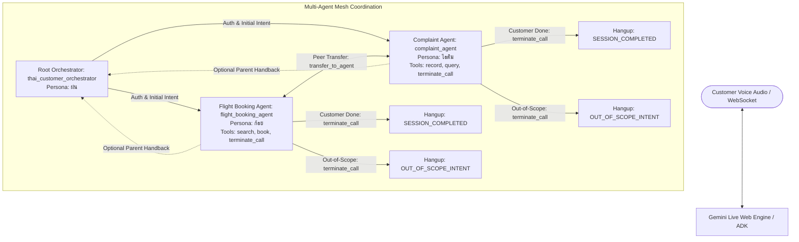
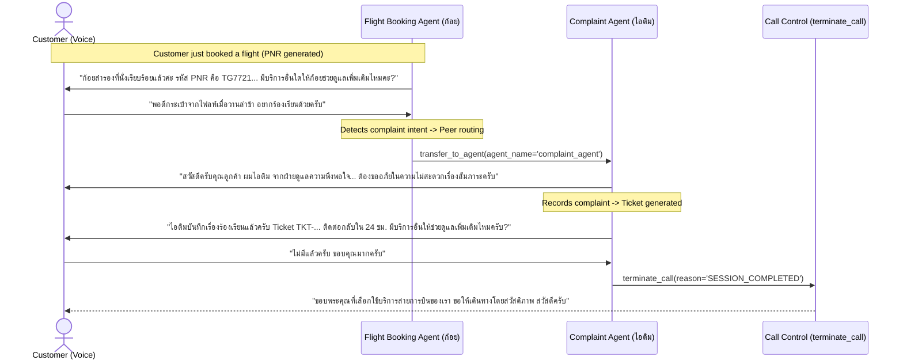

# Specification: [SPEC-20260908-DECENTRALIZED-SUBAGENT-COORDINATION]
# Decentralized Sub-Agent Coordination & Autonomous Concierge Loop in Google ADK

## 1. Problem Statement & Objectives

### 1.1 Context & Motivation
In the initial multi-agent architecture (codified in `SPEC-20260907-GEMINI-LIVE-ADK-THAI-VOICE-AGENT`), specialized sub-agents (`flight_booking_agent` and `complaint_agent`) were configured with a strict single-task execution pattern: immediately upon completing a booking confirmation or lodging a complaint ticket, the sub-agent was mandated to immediately transfer control back to `thai_customer_orchestrator` via `transfer_to_agent(agent_name='thai_customer_orchestrator')` in the same turn without asking the customer any follow-up questions.

While this centralized pattern preserved a rigid star topology, it introduces noticeable conversational friction in real-time voice:
1. **Unnatural Handoff Friction:** The customer hears the flight specialist (ก้อย) or complaint specialist (ไอติม) conclude the task, and then experiences an abrupt voice persona switch back to the front-desk concierge (ฝน) who asks *"มีบริการอื่นใดให้ช่วยดูแลเพิ่มเติมไหมคะ"*.
2. **Double Routing Latency:** If the customer had booked a flight with ก้อย and also wanted to file a complaint, bouncing through ฝน added an extra transfer turn before reaching ไอติม.
3. **Loss of Specialist Rapport:** Customers expect the specialist who just helped them to ask if there is anything else needed before either closing the call or routing them to the appropriate department.

### 1.2 Goals
Transform sub-agents from rigid single-turn leaf workers into autonomous service coordinators capable of handling the post-service concierge dialogue directly in their designated persona:
1. **Autonomous Concierge Inquiry:** After completing their primary domain task (verbal confirmation of PNR or verbal issuance of Ticket ID & SLA), sub-agents do *not* force a transfer back to `thai_customer_orchestrator`. Instead, they ask what else the customer needs using their own persona and tone.
2. **Direct Intent-Based Routing:**
   - **Route to Flight Booking:** If the customer wants to book a flight:
     - If the active agent is `flight_booking_agent`, handle or query new flight requirements directly.
     - If the active agent is `complaint_agent`, route to `flight_booking_agent` via `transfer_to_agent(agent_name='flight_booking_agent')`.
   - **Route to Complaint Resolution:** If the customer wants to complain or track an issue:
     - If the active agent is `complaint_agent`, handle or query grievance details directly.
     - If the active agent is `flight_booking_agent`, route to `complaint_agent` via `transfer_to_agent(agent_name='complaint_agent')`.
3. **Polite Out-of-Scope Termination:** If the customer asks for services outside flight booking and complaints (e.g., hotel booking, weather forecasts, general banter, stock advice, prompt injections), the sub-agent politely explains system boundaries and executes `terminate_call(reason='OUT_OF_SCOPE_INTENT')`.
4. **Polite Session Completion Termination:** If the customer indicates they are finished or want to hang up (e.g., *"ไม่มีแล้วครับ"*, *"ขอบคุณมากครับ"*), the sub-agent bids farewell in their persona and executes `terminate_call(reason='SESSION_COMPLETED')`.

### 1.3 Non-Goals
- Modifying initial authentication: The front-desk orchestrator (`thai_customer_orchestrator`) remains the entry gatekeeper for customer authentication before domain delegation.
- Introducing new external services outside the airline flight & complaint domains.

---

## 2. System Architecture & Topology

### 2.1 Decentralized Coordination Topology

### 2.2 Sequence Diagram: Cross-Department Transfer Flow

---

## 3. Tool Bindings & Agent Contracts

### 3.1 Tool Matrix Across Agents

| Agent | Domain Tools | Call Control Tools | Transfer Targets |
| :--- | :--- | :--- | :--- |
| `thai_customer_orchestrator` | `authenticate_customer`, `check_customer_status` | `terminate_call` | `flight_booking_agent`, `complaint_agent` |
| `flight_booking_agent` | `search_real_flights`, `confirm_flight_booking` | `terminate_call` | `complaint_agent`, `thai_customer_orchestrator` |
| `complaint_agent` | `record_customer_complaint`, `query_complaint_status` | `terminate_call` | `flight_booking_agent`, `thai_customer_orchestrator` |

### 3.2 Peer Transfer Mechanics in Google ADK
Under Google ADK `_get_transfer_targets(agent)`, sibling agents under the same parent agent automatically discover each other as peer transfer targets as long as `disallow_transfer_to_peers=False`.
Thus, `flight_booking_agent` and `complaint_agent` can invoke `transfer_to_agent` targeting each other without needing to route back to `thai_customer_orchestrator`.

---

## 4. Behavioral & Prompt Specifications

### 4.1 Flight Booking Agent (`flight_booking_agent` - ก้อย)
1. **Verbal Confirmation:** Complete PNR announcement, flight number, and total price.
2. **Concierge Loop Prompt:** *"มีบริการอื่นใดให้ก้อยช่วยดูแลเพิ่มเติมอีกไหมคะ?"*
3. **Intent Coordination Decision Tree:**
   - **More Flight Needs:** If the customer wants to search or book another flight, handle directly.
   - **Complaint Intent:** If the customer mentions grievance, delayed flight, lost luggage, bad service, invoke `transfer_to_agent(agent_name='complaint_agent')` immediately without redundant confirmation.
   - **Out of Scope:** If the customer requests hotel, weather, stock, chit-chat, or jailbreak, politely decline and invoke `terminate_call(reason='OUT_OF_SCOPE_INTENT')`.
   - **Completion / Hangup:** If the customer responds that they are finished (*"ไม่มีแล้ว", "ขอบคุณมาก", "เรียบร้อยแล้ว"*), bid farewell and invoke `terminate_call(reason='SESSION_COMPLETED')`.

### 4.2 Complaint Resolution Agent (`complaint_agent` - ไอติม)
1. **Verbal Confirmation:** Complete Ticket ID and SLA announcement with empathetic tone.
2. **Concierge Loop Prompt:** *"มีบริการอื่นใดให้ไอติมช่วยดูแลเพิ่มเติมอีกไหมครับ?"*
3. **Intent Coordination Decision Tree:**
   - **Flight Booking Intent:** If the customer wants to book a flight or check flight schedules, invoke `transfer_to_agent(agent_name='flight_booking_agent')` immediately without redundant confirmation.
   - **More Complaint Needs:** If the customer has additional incident details or ticket queries, handle directly.
   - **Out of Scope:** If the customer requests out-of-scope services, politely decline and invoke `terminate_call(reason='OUT_OF_SCOPE_INTENT')`.
   - **Completion / Hangup:** If the customer responds that they are finished (*"ไม่มีแล้ว", "ขอบคุณครับ", "เรียบร้อยครับ"*), bid farewell and invoke `terminate_call(reason='SESSION_COMPLETED')`.

---

## 5. Step-by-Step Implementation Plan & Test Design

### Step 1: Sub-Agent Tool Bindings & Call Control Integration
- **Implementation:** Bind `terminate_call` to `flight_booking_agent.tools` and `complaint_agent.tools` in `app/agent.py`.
- **Unit Tests:** Verify that `terminate_call` is present in tool lists for all 3 agents in `tests/test_step3_agents.py`.
- **Property-Based Tests (PBT):** Invariant testing verifying that all agents possess the required terminal control capabilities.
- **Completion Criteria:** Unit and property tests pass with tool binding assertions verified.

### Step 2: Flight Booking Agent Prompt Refactoring
- **Implementation:** Update `FLIGHT_BOOKING_INSTRUCTION` in `app/agent.py` to remove forced handback and insert the 4-pronged coordination decision tree.
- **Unit Tests:** Verify instruction contains concierge inquiry and peer routing directives (`complaint_agent`, `terminate_call`, `OUT_OF_SCOPE_INTENT`, `SESSION_COMPLETED`).
- **Property-Based Tests (PBT):** Invariant test simulating customer post-booking signals and verifying appropriate routing/termination mappings.
- **Completion Criteria:** Tests pass verifying flight agent prompt rules.

### Step 3: Complaint Agent Prompt Refactoring
- **Implementation:** Update `COMPLAINT_INSTRUCTION` in `app/agent.py` to remove forced handback and insert the 4-pronged coordination decision tree.
- **Unit Tests:** Verify instruction contains concierge inquiry and peer routing directives (`flight_booking_agent`, `terminate_call`, `OUT_OF_SCOPE_INTENT`, `SESSION_COMPLETED`).
- **Property-Based Tests (PBT):** Invariant test simulating customer post-complaint signals and verifying appropriate routing/termination mappings.
- **Completion Criteria:** Tests pass verifying complaint agent prompt rules.

### Step 4: Full Test Suite Verification & Plan Progress Tracking
- **Implementation:** Execute full test suite (`pytest`) across all modules (models, tools, agents, server, PBT).
- **Documentation:** Create `specs/plan/PROGRESS_REPORT_20260908.md` and update `specs/README.md`.
- **Completion Criteria:** 100% test pass rate with zero regressions.
