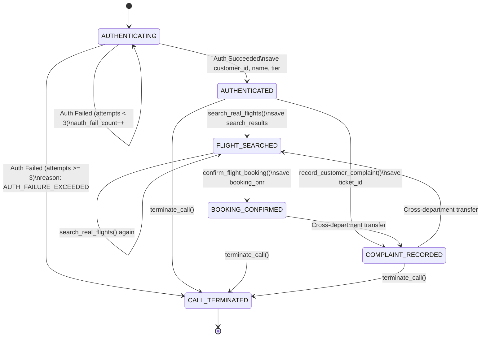

# Specification: [SPEC-20260908-TOOL-CONTEXT-STATE-DETERMINISM]
# ToolContext State Determinism: Auth Counter, Session Identity & Stage Machine

## 1. Problem Statement & Objectives

### 1.1 Context & Motivation
In conversational multimodal voice systems powered by Gemini Live and Google ADK, probabilistic generation can lead to operational deviations when managing state-sensitive rules solely via system instructions (prompts):
1. **Unreliable Failed Attempt Counting:** Prompts instruct the agent to terminate after 3 failed verification attempts (Guardrail 1A), but LLMs frequently lose count or misjudge attempts in dynamic multi-turn voice streaming.
2. **Context Drift in Sub-Agent Identity Binding:** When transferring between orchestrator and sub-agents (`flight_booking_agent` and `complaint_agent`), the model must pass `customer_id` and `passenger_name` to booking and complaint recording tools. If the model fails to supply these parameters or hallucinates an ID, downstream bookings and tickets fail or attach to null identities.
3. **Implicit Flow Ambiguity:** Without a formal stage machine in session state, the system cannot programmatically verify whether a customer has already completed search, booking, or complaint logging, risking repetitive questioning or state inconsistency.

### 1.2 Goals
1. **Deterministic Failed Auth Counter:** Use `tool_context.state["auth_fail_count"]` to mathematically track consecutive authentication failures. When `auth_fail_count >= 3`, transition state to `CALL_TERMINATED` with `AUTH_FAILURE_EXCEEDED`.
2. **Session Identity Injection:** Ingest verified customer credentials (`customer_id`, `customer_name`, `loyalty_tier`) into `tool_context.state` upon authentication. Ensure `confirm_flight_booking` and `record_customer_complaint` automatically retrieve and bind this identity when parameters are omitted by the LLM.
3. **Session Stage Machine:** Track the conversation lifecycle deterministically via `tool_context.state["session_stage"]` across:
   - `AUTHENTICATING` -> `AUTHENTICATED` -> `FLIGHT_SEARCHED` -> `BOOKING_CONFIRMED` / `COMPLAINT_RECORDED` -> `CALL_TERMINATED`.
   - Store deterministic references: `last_booking_pnr`, `last_ticket_id`, and `termination_reason`.

### 1.3 Non-Goals
- Replacing live voice audio streaming with turn-based forms.
- Removing LLM flexibility in natural conversation phrasing.

---

## 2. System Architecture & State Machine

### 2.1 State Machine Lifecycle Diagram

---

## 3. Session State Schema (`tool_context.state`)

| State Key | Type | Description |
| :--- | :--- | :--- |
| `auth_fail_count` | `int` | Number of consecutive failed authentication attempts (resets to 0 on success). |
| `is_authenticated` | `bool` | True if customer credentials successfully verified. |
| `customer_id` | `Optional[str]` | Unique identifier of the authenticated customer (e.g. `CUST-001`). |
| `customer_name` | `Optional[str]` | Full Thai name of the authenticated customer (e.g. `สมชาย ใจดี`). |
| `loyalty_tier` | `Optional[str]` | Customer tier (e.g. `Platinum`, `Gold`, `Silver`). |
| `session_stage` | `str` | Current lifecycle stage enum value (`AUTHENTICATING`, `AUTHENTICATED`, `FLIGHT_SEARCHED`, `BOOKING_CONFIRMED`, `COMPLAINT_RECORDED`, `CALL_TERMINATED`). |
| `last_booking_pnr` | `Optional[str]` | Most recently confirmed 6-character PNR. |
| `last_ticket_id` | `Optional[str]` | Most recently lodged ticket ID. |
| `is_call_active` | `bool` | True while voice call is active; False upon termination. |
| `termination_reason` | `Optional[str]` | Rationale code if terminated (`AUTH_FAILURE_EXCEEDED`, `OUT_OF_SCOPE_INTENT`, `SESSION_COMPLETED`, `CUSTOMER_DISCONNECT`). |

---

## 4. Tool Updates & Deterministic Contracts

### 4.1 `authenticate_customer` ([`app/tools/auth_tools.py`](../app/tools/auth_tools.py))
- Reads `tool_context.state.get("auth_fail_count", 0)`.
- If credentials mismatch:
  - Increments `tool_context.state["auth_fail_count"] += 1`.
  - If count >= 3:
    - Sets `tool_context.state["session_stage"] = "CALL_TERMINATED"`.
    - Sets `tool_context.state["termination_reason"] = "AUTH_FAILURE_EXCEEDED"`.
    - Sets `tool_context.state["is_call_active"] = False`.
- If credentials match:
  - Resets `tool_context.state["auth_fail_count"] = 0`.
  - Sets `tool_context.state["is_authenticated"] = True`.
  - Sets `tool_context.state["customer_id"] = customer.customer_id`.
  - Sets `tool_context.state["customer_name"] = customer.name_th`.
  - Sets `tool_context.state["loyalty_tier"] = customer.loyalty_tier`.
  - Sets `tool_context.state["session_stage"] = "AUTHENTICATED"`.
  - Handles hybrid intent transfer if provided.

### 4.2 `search_real_flights` ([`app/tools/flight_tools.py`](../app/tools/flight_tools.py))
- Ingests `tool_context: Optional[Any] = None`.
- If present, sets:
  - `tool_context.state["session_stage"] = "FLIGHT_SEARCHED"`.
  - `tool_context.state["last_search_departure"] = dep`.
  - `tool_context.state["last_search_arrival"] = arr`.

### 4.3 `confirm_flight_booking` ([`app/tools/flight_tools.py`](../app/tools/flight_tools.py))
- Ingests `tool_context: Optional[Any] = None`.
- Fallbacks for identity parameters:
  - `resolved_customer_id = customer_id or (tool_context.state.get("customer_id") if tool_context else None)`.
  - `resolved_passenger_name = passenger_name or (tool_context.state.get("customer_name") if tool_context else None)`.
- On success:
  - Sets `tool_context.state["session_stage"] = "BOOKING_CONFIRMED"`.
  - Sets `tool_context.state["last_booking_pnr"] = pnr`.

### 4.4 `record_customer_complaint` ([`app/tools/complaint_tools.py`](../app/tools/complaint_tools.py))
- Ingests `tool_context: Optional[Any] = None`.
- Fallbacks for identity parameters:
  - `resolved_customer_id = customer_id or (tool_context.state.get("customer_id") if tool_context else None)`.
  - `resolved_customer_name = customer_name or (tool_context.state.get("customer_name") if tool_context else None)`.
- On success:
  - Sets `tool_context.state["session_stage"] = "COMPLAINT_RECORDED"`.
  - Sets `tool_context.state["last_ticket_id"] = ticket_id`.

### 4.5 `terminate_call` ([`app/tools/call_control_tools.py`](../app/tools/call_control_tools.py))
- Ingests `tool_context: Optional[Any] = None`.
- Sets:
  - `tool_context.state["session_stage"] = "CALL_TERMINATED"`.
  - `tool_context.state["is_call_active"] = False`.
  - `tool_context.state["termination_reason"] = reason_enum.value`.

---

## 5. Step-by-Step Implementation Plan & Test Design

### Step 1: Authentication Tool State Enhancement
- **Implementation:** Update `authenticate_customer` in `app/tools/auth_tools.py` with `auth_fail_count` counting, max 3 attempts state mutation, and customer profile ingestion into `tool_context.state`.
- **Unit Tests:** Test 1 failure (count=1), 2 failures (count=2), 3 failures (triggers terminal state), and success reset (count=0, customer ingested).
- **Property-Based Tests (PBT):** Invariant test with arbitrary sequences of failed attempts verifying monotonic counter until max cap.

### Step 2: Flight & Complaint Tools Identity Fallback & Stage Updates
- **Implementation:** Update `search_real_flights`, `confirm_flight_booking`, and `record_customer_complaint` to accept `tool_context`, resolve identity from state when params are None, and update stage machine.
- **Unit Tests:** Verify that booking and complaint succeed without explicit `customer_id` if identity is in state.
- **Property-Based Tests (PBT):** Invariant test across random customer profiles verifying identity preservation in bookings and complaints.

### Step 3: Call Control Tool State Integration
- **Implementation:** Update `terminate_call` to accept `tool_context` and record `session_stage`, `termination_reason`, and `is_call_active`.
- **Unit Tests:** Verify terminal state mutation on all termination reasons.
- **Property-Based Tests (PBT):** Invariant test verifying terminal state consistency across all `CallTerminationReason` values.

### Step 4: Verification, Spec Synchronization & Progress Report
- **Implementation:** Run full test suite (`pytest`).
- **Documentation:** Update `specs/README.md` and create `specs/plan/PROGRESS_REPORT_20260908.md`.
- **Completion Criteria:** All tests passing.
