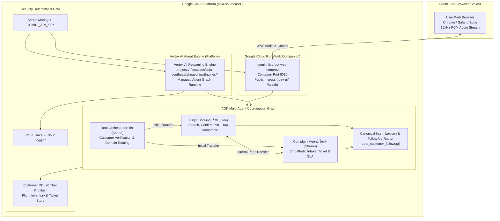

# Unified Specification: Gemini Live Bot System Architecture, Agent Engine & Cloud Platform

**Specification Document ID:** `SPEC-SYSTEM-UNIFIED`  
**Consolidates:**
- `SPEC-20260907-GEMINI-LIVE-ADK-THAI-VOICE-AGENT.md` (Core Voice Platform & Orchestration)
- `SPEC-20260908-DECENTRALIZED-SUBAGENT-COORDINATION.md` (Autonomous Sub-Agent Coordination & Concierge)
- `SPEC-20260908-TOOL-CONTEXT-STATE-DETERMINISM.md` (ToolContext State Determinism & 3-Strike Security Gate)
- `SPEC-20260908-FOLLOWUP-INTENT-ROUTING-TOOL.md` (Canonical Follow-Up Intent Routing Tool)
- `SPEC-20260909-VERTEX-AI-AGENT-ENGINE-DEPLOYMENT.md` (Vertex AI Agent Engine via Agents CLI)
- `SPEC-20260909-CLOUD-RUN-ADK-WEB-SERVICE.md` (Cloud Run ADK Web Companion with Rule 10 Public Ingress)

**Target Foundation Models:** `gemini-3.1-flash-live-preview` (AI Studio Live API) / `gemini-live-2.5-flash-native-audio` (Vertex AI)  
**Agent Framework:** Google Agent Development Kit (`google-adk v2.8.0`)  
**Deployment Platform:** Vertex AI Agent Engine (`reasoningEngines`) & Cloud Run ADK Web Companion (`gemini-live-bot-web-nonprod`)  
**Status:** Implemented, Fully Tested (67/67 passing), Deployed & Active

---

## 1. Executive Summary & System Objectives

The **Gemini Live Bot** is an enterprise-grade, multimodal, voice-first intelligent customer service platform built using the official **Google Agent Development Kit (ADK)** and the Gemini Live Multimodal API.

### Core Architectural Capabilities:
1. **Decentralized Multi-Agent Coordination:**
   - **Front-desk Orchestrator (`thai_customer_orchestrator` / ฝน - Aoede):** Greets customers, executes strict 2-factor authentication, and transfers directly to domain sub-agents without redundant banter.
   - **Flight Booking Agent (`flight_booking_agent` / ก้อย - Kore):** Searches flight inventories, presents top-3 ranked options, confirms bookings, issues PNR codes, and executes post-service follow-up.
   - **Complaint Agent (`complaint_agent` / ไอติม - Charon):** Empathizes with customer grievances, categorizes complaint taxonomies, registers tickets with SLA commitments, and executes post-service follow-up.
   - **Peer Lateral Transfers:** Domain sub-agents coordinate laterally via `route_customer_followup` without bouncing back to the root orchestrator.
2. **Deterministic State & Security Guardrails:**
   - **3-Strike Auth Failure Gate:** $\ge 3$ consecutive verification failures strictly triggers `terminate_call(reason="AUTH_FAILURE_EXCEEDED")`.
   - **Zero Unauthenticated Bookings:** Bookings require verified identity in `tool_context.state`.
   - **Out-of-Scope Protection:** Unauthorized requests trigger `terminate_call(reason="OUT_OF_SCOPE_INTENT")`.
   - **Lossless Calendar Conversion:** Exact conversion between Thai Buddhist Era (พ.ศ.) and Gregorian Common Era (ค.ศ.).
3. **Dual-Tier Cloud Deployment Topology:**
   - **Tier 1: Vertex AI Agent Engine (`reasoningEngines`):** Managed backend agent runtime deployed via `agents-cli deploy --deployment-target agent_runtime` with OpenTelemetry and Cloud Trace enabled.
   - **Tier 2: Google Cloud Run ADK Web UI Companion (`/dev-ui/`):** Containerized web server providing public browser testing with microphone voice streaming under Rule 10 Pattern 3 (`run.googleapis.com/invoker-iam-disabled: "true"`).

---

## 2. System Architecture & Component Interaction



---

## 3. Data Models & State Contracts

### 3.1 Session State Schema (`tool_context.state`)
| State Key | Type | Description |
| :--- | :--- | :--- |
| `authenticated` | `bool` | True once user successfully verified name & birthdate |
| `customer_id` | `str` | Verified customer ID (e.g., `CUST-TH-001`) |
| `customer_name` | `str` | Thai verified customer name |
| `loyalty_tier` | `str` | `Platinum`, `Gold`, `Silver`, or `Member` |
| `auth_fail_count`| `int` | Number of consecutive failed verification attempts (0-3) |
| `session_stage` | `str` | Lifecycle stage (`GREETING`, `AUTHENTICATED`, `IN_FLIGHT_SERVICE`, `IN_COMPLAINT_SERVICE`, `COMPLETED`, `TERMINATED`) |
| `current_agent` | `str` | Currently active agent name |

### 3.2 Canonical Intent Taxonomy (`app/intent_lexicon.py`)
- `FLIGHT_BOOKING`: Keywords matching flights, destinations, reservations, changes, schedules.
- `COMPLAINT`: Keywords matching grievances, delays, lost luggage, staff behavior, refunds.
- `SESSION_COMPLETED`: Keywords matching polite conclusions (ขอบคุณ, เรียบร้อยแล้ว, ไม่มีแล้ว).
- `OUT_OF_SCOPE`: Any inquiries unrelated to airline operations (stocks, dining outside airport, coding, etc.).

---

## 4. Multi-Agent Personas & Voice Profiles

| Agent | Thai Persona | Role | Prebuilt Voice | Primary Tools |
| :--- | :--- | :--- | :--- | :--- |
| `thai_customer_orchestrator` | ฝน (Fon) | Front-desk triage & authentication | **Aoede** | `authenticate_customer`, `terminate_call` |
| `flight_booking_agent` | ก้อย (Koi) | Reservations, flight discovery & PNR | **Kore** | `search_flights`, `confirm_flight_booking`, `route_customer_followup`, `terminate_call` |
| `complaint_agent` | ไอติม (Itim) | Empathetic grievance logging & SLA | **Charon** | `file_complaint`, `route_customer_followup`, `terminate_call` |

---

## 5. Dual-Tier Cloud Deployment Specification

### 5.1 Tier 1: Vertex AI Agent Engine (`reasoningEngines`)
- **Manifest:** `agents-cli-manifest.yaml` (`deployment_target: agent_runtime`, `agent_directory: app`, `region: asia-southeast1`).
- **Resource Configuration:** `.agent_engine_config.json` (1 CPU, 4Gi Memory, min=0, max=5 nonprod).
- **Deployment Command:** `agents-cli deploy --deployment-target agent_runtime` (automated via `./scripts/deploy.sh nonprod agent`).
- **Telemetry:** `GOOGLE_CLOUD_AGENT_ENGINE_ENABLE_TELEMETRY=true`, `OTEL_INSTRUMENTATION_GENAI_CAPTURE_MESSAGE_CONTENT=true`.
- **Deployed Resource:** `projects/114618371568/locations/asia-southeast1/reasoningEngines/7481648861434347520`.

### 5.2 Tier 2: Cloud Run ADK Web UI Companion
- **Service Name:** `gemini-live-bot-web-nonprod`
- **Container Build:** Multi-stage `Dockerfile` with non-root execution user `10001:10001` (`appuser`).
- **Liveness Probe:** `curl -f http://localhost:8080/health || exit 1`.
- **Public Ingress Architecture (Rule 10 Pattern 3):**
  - Configured with `run.googleapis.com/invoker-iam-disabled: "true"` and `ingress: "all"`.
  - Provides direct browser access to `/dev-ui/` without violating GCP Organization Domain-Restricted Sharing.
- **Deployed URL:** `https://gemini-live-bot-web-nonprod-cwmwtobz3a-as.a.run.app/dev-ui/`.

---

## 6. Unified Deployment Script Contracts (`scripts/deploy.sh`)

```bash
# Preview deployment configuration without modifying cloud resources (Dry-Run)
./scripts/deploy.sh nonprod web --dry-run
./scripts/deploy.sh nonprod agent --dry-run

# Deploy the Interactive Web UI Companion to Cloud Run (Browser Access)
./scripts/deploy.sh nonprod web

# Deploy the Multi-Agent Engine to Vertex AI Agent Engine
./scripts/deploy.sh nonprod agent

# Deploy both Vertex AI Agent Engine & Cloud Run Web UI
./scripts/deploy.sh nonprod all

# Check status of deployed Vertex AI Agent Engine
./scripts/deploy.sh --status
```

---

## 7. Architectural Invariants Matrix

| ID | Invariant Name | Enforcement Mechanism |
| :--- | :--- | :--- |
| **Inv-1** | **Zero Unauthenticated Bookings** | `confirm_flight_booking` verifies authenticated identity in `tool_context.state`. |
| **Inv-2** | **3-Strike Auth Lockout** | `authenticate_customer` tracks `auth_fail_count` and triggers `terminate_call(reason="AUTH_FAILURE_EXCEEDED")` at strike 3. |
| **Inv-3** | **Strict Scope Boundary** | Out-of-scope requests trigger `terminate_call(reason="OUT_OF_SCOPE_INTENT")`. |
| **Inv-4** | **Top-3 Price Monotonicity** | `search_flights` returns exactly 3 flights strictly sorted by price ascending. |
| **Inv-5** | **Universal Empathy Standard** | `complaint_agent` acknowledges customer inconvenience in polite Thai before capturing problem taxonomy. |
| **Inv-6** | **Decentralized Concierge Routing** | Sub-agents conduct follow-up inquiry directly using `route_customer_followup`, routing laterally to peer sub-agents. |
| **Inv-7** | **Canonical Intent Symmetry** | All agents share identical intent detection regex in `app/intent_lexicon.py`. |
| **Inv-8** | **Dual-Tier Complementarity** | Vertex AI Agent Engine and Cloud Run Web UI share identical unified `.env` configurations. |
| **Inv-9** | **Rule 10 Public Ingress Compliance** | Public access to Cloud Run achieved through `invoker-iam-disabled=true` rather than prohibited `allUsers` IAM member bindings. |

---

## 8. Verification & Test Suite

The unified test suite enforces all invariants across 67 unit and property-based test cases:
- `tests/test_step1_models.py` & `test_step1_pbt.py`: 13 passed (lossless P.S. <-> C.E. conversion, PNR format).
- `tests/test_step2_tools.py` & `test_step2_pbt.py`: 32 passed (top-3 price monotonicity, 3-strike lockout, ticket generation).
- `tests/test_step3_agents.py` & `test_step3_pbt.py`: 14 passed (orchestrator greeting, peer handoff, voice profiles).
- `tests/test_step4_server.py` & `test_step4_pbt.py`: 8 passed (health probe invariance, termination semantics).
